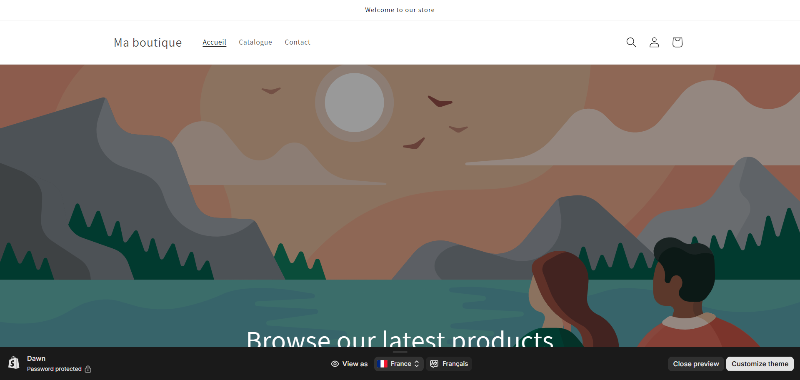
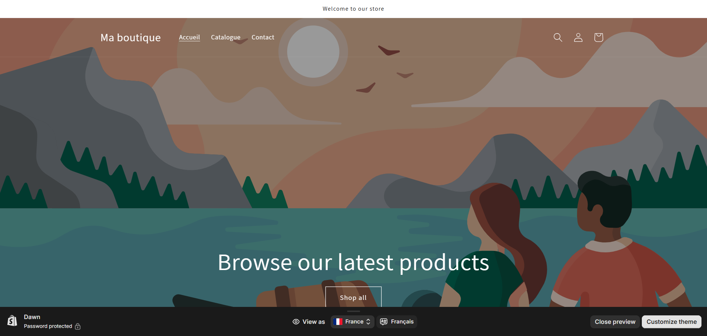
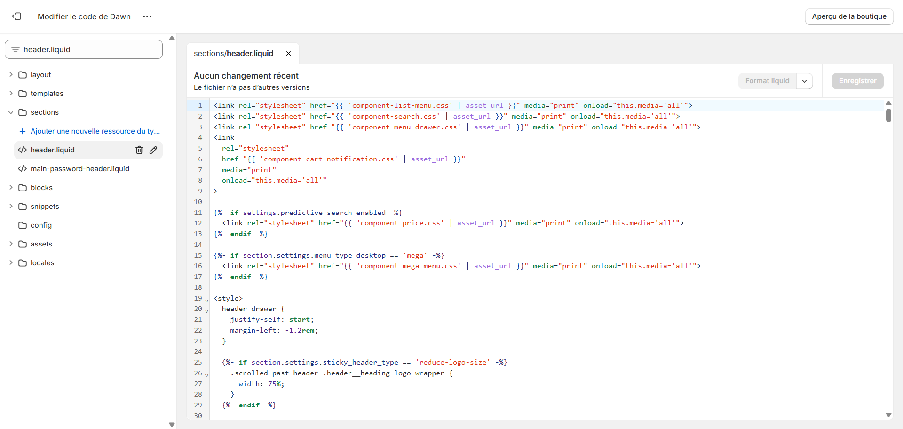

# Header Transparent pour la Page d'Accueil Shopify

Cette documentation explique comment créer un header transparent élégant sur la page d'accueil de votre boutique Shopify en utilisant uniquement du CSS personnalisé. Cette solution fonctionne avec tous les thèmes gratuits de Shopify, notamment le thème "Draw" présenté en exemple.

## Aperçu du résultat

### Avant modification (Thème Draw standard)


### Après modification (Header transparent)


## Guide d'implémentation

Le code ci-dessous permet de rendre le header transparent uniquement sur la page d'accueil, tout en conservant son apparence normale sur les autres pages.

### Étape 1: Accéder à l'éditeur de code
1. Dans votre tableau de bord Shopify, allez dans **Boutique en ligne** > **Thèmes**
2. Cliquez sur **Actions** > **Modifier le code** pour votre thème actif

### Étape 2: Localiser et modifier le fichier header
1. Dans le navigateur de fichiers à gauche, recherchez **header.liquid** (généralement dans le dossier "sections")
2. Ouvrez le fichier header.liquid



### Étape 3: Ajouter le code CSS personnalisé
Insérez le code suivant au tout début du fichier:

```liquid

<style>
/* 
=================================================================
Header Transparent pour Page d'Accueil
Auteur: Eryaz (https://github.com/eryaz2025)
=================================================================
*/
.header-wrapper {
    position: absolute;
    width: 100%;
    background: transparent;
    color: white;
}

.header-wrapper .list-menu span,
details[open]>.header__menu-item,
.header-wrapper summary svg,
.header-wrapper a svg,
.header-wrapper h1.header__heading span.h2,
.header-wrapper details>span,
.header-wrapper .disclosure__button>span,
.header-wrapper .disclosure__button svg {
    color: white !important;
}

.header-localization .disclosure .localization-form__select:hover {
    text-decoration-color: white;
}

.section-header {
    margin-bottom: 0;
}

.header-wrapper--border-bottom {
    border-bottom: .1rem solid rgba(255, 255, 255, .08);
}

.overflow-hidden-desktop .header-wrapper,
.overflow-hidden-tablet .header-wrapper {
    position: initial;
    width: initial;
    background: initial;
    color: initial;
    background: var(--gradient-background);
}

.header-wrapper summary.header__menu-item+ul span,
.header-wrapper summary.header__menu-item+ul svg,
.overflow-hidden-desktop .header-wrapper .list-menu span,
.overflow-hidden-desktop details[open]>.header__menu-item,
.overflow-hidden-desktop .header-wrapper summary svg,
.overflow-hidden-desktop .header-wrapper a svg,
.overflow-hidden-desktop .header-wrapper h1.header__heading span.h2,
.overflow-hidden-desktop .header-wrapper details>span,
.overflow-hidden-desktop .header-wrapper .disclosure__button>span,
.overflow-hidden-desktop .header-wrapper .disclosure__button svg,
.overflow-hidden-tablet .header-wrapper .list-menu span,
.overflow-hidden-tablet details[open]>.header__menu-item,
.overflow-hidden-tablet .header-wrapper summary svg,
.overflow-hidden-tablet .header-wrapper a svg,
.overflow-hidden-tablet .header-wrapper h1.header__heading span.h2,
.overflow-hidden-tablet .header-wrapper details>span,
.overflow-hidden-tablet .header-wrapper .disclosure__button>span,
.overflow-hidden-tablet .header-wrapper .disclosure__button svg {
    color: rgba(var(--color-foreground), .75) !important
}
</style>

```

### Étape 4: Enregistrer et vérifier
1. Cliquez sur "Enregistrer"
2. Consultez votre page d'accueil pour voir le résultat

## Explications techniques

- **Condition Liquid**: La condition `` assure que le style ne s'applique qu'à la page d'accueil.
- **Position absolue**: Le header est positionné en absolu pour qu'il flotte au-dessus du contenu de la page.
- **Couleur du texte**: Tous les éléments textuels et icônes sont définis en blanc pour être visibles sur des arrière-plans foncés.
- **Adaptabilité mobile**: Des règles spéciales sont incluses pour que le header retrouve son apparence normale lorsque le menu mobile est ouvert.

## Personnalisations possibles

### Changer la couleur du texte
Pour modifier la couleur du texte, remplacez `white` dans le CSS par la couleur de votre choix.

### Ajouter un effet de fond semi-transparent
Pour créer un effet de fond semi-transparent au lieu d'un fond totalement transparent, modifiez la ligne:
```css
background: transparent;
```

Par exemple, pour un fond noir avec 30% d'opacité:
```css
background: rgba(0, 0, 0, 0.3);
```

### Personnaliser la bordure inférieure
Vous pouvez ajuster ou supprimer la bordure subtile au bas du header en modifiant:
```css
border-bottom: .1rem solid rgba(255, 255, 255, .08);
```

---

## 👨‍💻 Auteur
Créé par [Eryaz](https://github.com/eryaz2025)